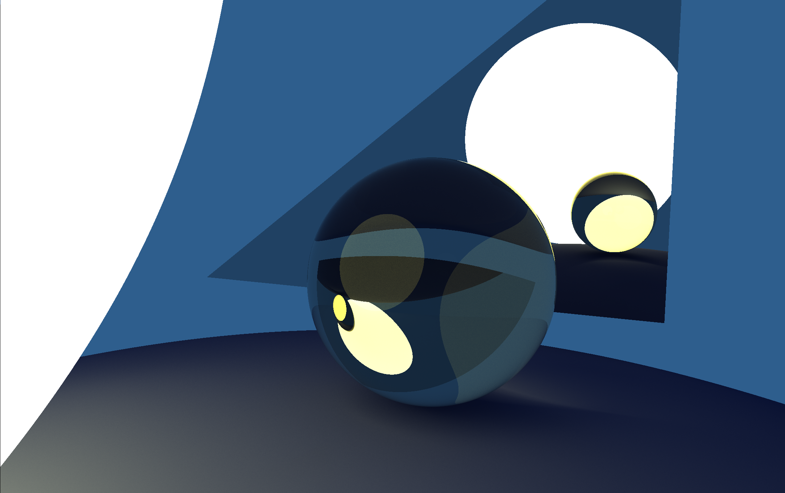

# RayTracer
My own Ray Tracer based on the Chernos ray tracing series ([here](https://www.youtube.com/playlist?list=PLlrATfBNZ98edc5GshdBtREv5asFW3yXl)). Multiple features added on my own from e.g. the Ray Tracing in One Weekend Series ([here](https://github.com/RayTracing/raytracing.github.io/)).

It currently supports:
- Spheres and triangles as geometry primitives.
- Lambertian diffuse materials.
- Metallic reflective materials.
- Emissive Materials.
- Dielectric materials and refraction, as well as Schlick approximation for reflections.

In the future I want to add:
- Textures.
- BVH.
- Using triangluated 3D models.
- GPU rendering.

## Rendered Image

### 3rd party libaries
- [Walnut](https://github.com/StudioCherno/Walnut)
- [Dear ImGui](https://github.com/ocornut/imgui)
- [GLFW](https://github.com/glfw/glfw)
- [stb_image](https://github.com/nothings/stb)
- [GLM](https://github.com/g-truc/glm) (included for convenience)
